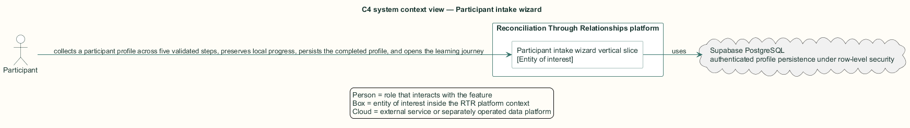
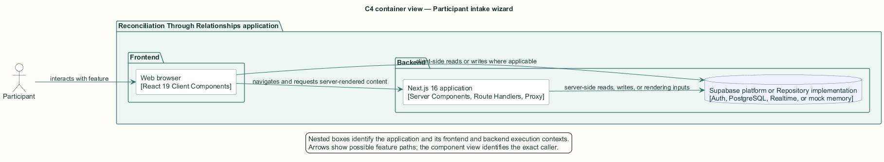
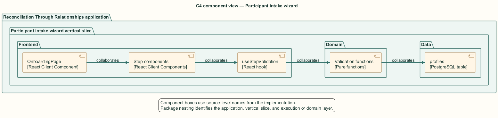
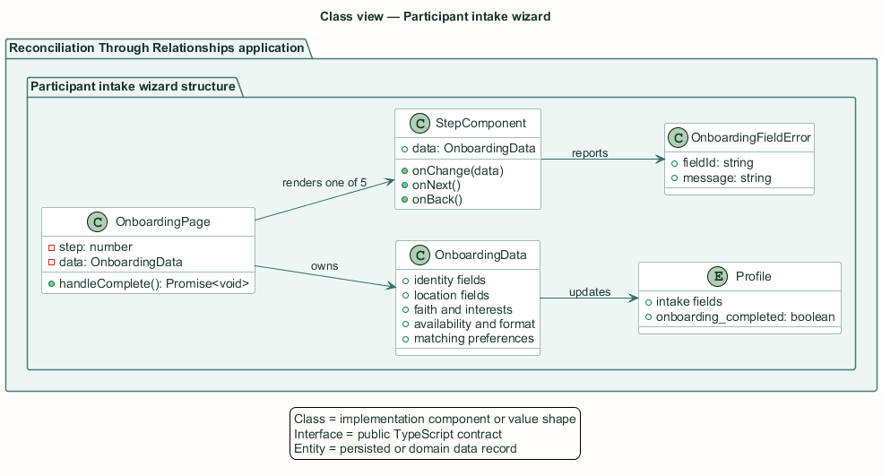
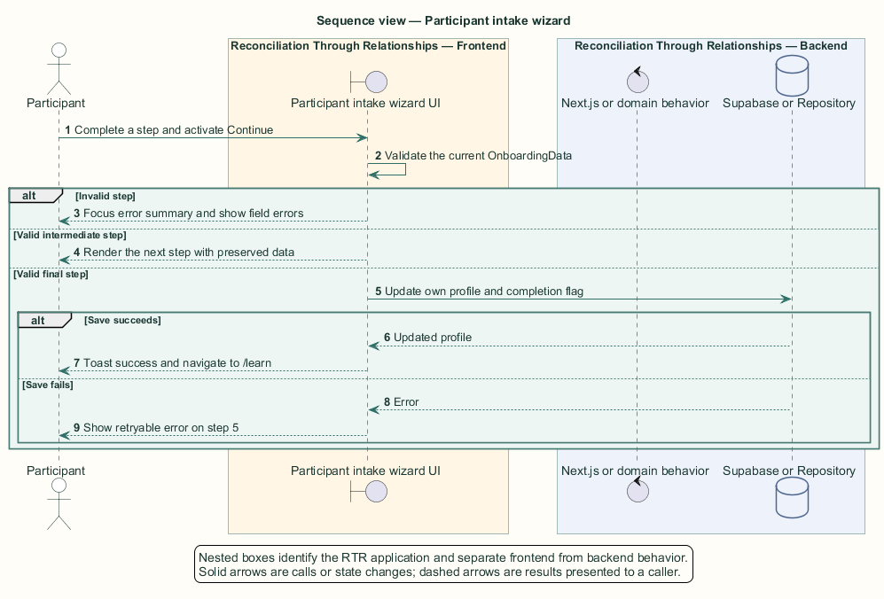

# Participant intake wizard — Detailed design

## Overview

Participant intake wizard — vertical slice that collects a participant profile across five validated steps, preserves local progress, persists the completed profile, and opens the learning journey

A newly authenticated participant has an application profile containing default values but no relationship-building details. Onboarding collects identity, location, faith and interests, availability, participation format, languages, consent, and matching preferences.

The wizard is a browser client component because step navigation, inline correction, focus movement, and retry state require interactive state. The final operation updates the authenticated participant's own `profiles` row under row-level security.

The entity of interest (EoI) is the Participant intake wizard vertical slice of the Reconciliation Through Relationships platform. This focused architecture description (AD) describes that slice and does not claim full conformance with 42010:2022.

## Description

### Components, types, functions, and classes

| Element | Kind | Source | Responsibility and public interface |
| --- | --- | --- | --- |
| `OnboardingPage` | React Client Component | `src/app/onboarding/page.tsx` | Owns `OnboardingData`, current step, final save, toasts, and navigation. |
| `Step components` | React Client Components | `src/app/onboarding/components/Step*.tsx` | Five forms receive `data`, `onChange`, and navigation callbacks. |
| `useStepValidation` | React hook | `src/app/onboarding/components/useStepValidation.ts` | Runs a validator, stores errors, and focuses the summary on invalid submit. |
| `Validation functions` | Pure functions | `src/app/onboarding/validation.ts` | Return `OnboardingFieldError[]` for steps one through four. |
| `profiles` | PostgreSQL table | `public.profiles` | Final update stores intake fields and sets `onboarding_completed=true`. |

### Structure and relationships

- `OnboardingPage` passes one `OnboardingData` object through all step components, so back navigation preserves values.

- Each required step composes `useStepValidation` with a pure validation function and `ErrorSummary` or `FieldErrorMessage` output.

- The final step normalizes interests and updates the caller's profile through the browser Supabase client.

### Behaviour

1. The participant enters data and activates Continue on the current step.

2. The step validator returns field identifiers and exact messages for invalid values.

3. The error summary receives focus and links each error to its field; valid input advances the wizard.

4. The final step updates the profile and sets `onboarding_completed` when every earlier step is valid.

5. A successful update opens `/learn`; a failed update retains the final step and re-enables submission.

## Requirements

This section contains L2 requirements only. It intentionally includes no L1 requirement text. The L1 specification identifier records the traceability correspondence for each L2 requirement.

| L2 specification ID | L1 specification ID | Requirement text |
| --- | --- | --- |
| `L2-ONBRD-015` | `L1-ONBRD-005` | Onboarding shall guide the participant through five steps — Basic Info, Location & Treaty, Faith & Interests, Availability & Format, Matching Preferences — persist the profile, and open the learning journey. |
| `L2-ONBRD-016` | `L1-ONBRD-005` | Step 1 (Basic Info) shall validate on Continue and present a focusable error summary with anchor links plus inline field errors, using exact messages. |
| `L2-ONBRD-017` | `L1-ONBRD-005` | The age field shall accept only integers from 13 to 120. |
| `L2-ONBRD-018` | `L1-ONBRD-005` | Steps 2–4 shall validate their required groups on Continue with exact messages (step 5 has no required fields). |
| `L2-ONBRD-019` | `L1-ONBRD-005` | A failed final save shall keep the participant on the last step with a retryable error. |

## Diagrams

The five architecture views use one caption pattern and stable EoI-local names. Each view component is available as PlantUML source and as an inline Portable Network Graphics (PNG) rendering.

### C4 system context view

[PlantUML source](diagrams/c4-context.puml)

Figure 1 — C4 system context view: the Participant intake wizard EoI, its actor, and its external dependencies. The view component uses the C4 system context model kind.

### C4 container view

[PlantUML source](diagrams/c4-container.puml)

Figure 2 — C4 container view: the frontend, backend, data, and integration boundaries. The view component uses the C4 container model kind.

### C4 component view

[PlantUML source](diagrams/c4-component.puml)

Figure 3 — C4 component view: the source-level components and their structural relationships. The view component uses the C4 component model kind.

### Class view

[PlantUML source](diagrams/class-diagram.puml)

Figure 4 — Class view: the feature types, functions, classes, entities, and their relationships. The view component uses the Unified Modeling Language (UML) class model kind.

### Sequence view

[PlantUML source](diagrams/sequence-diagram.puml)

Figure 5 — Sequence view: the principal end-to-end feature behavior. Nested application boxes separate frontend behavior from backend behavior. The view component uses the UML sequence model kind.
