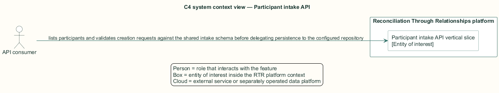
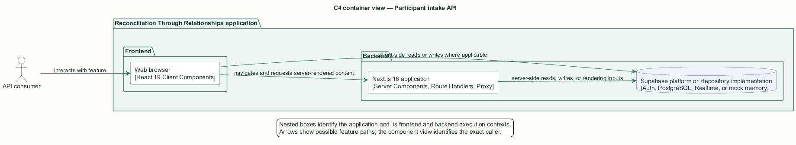
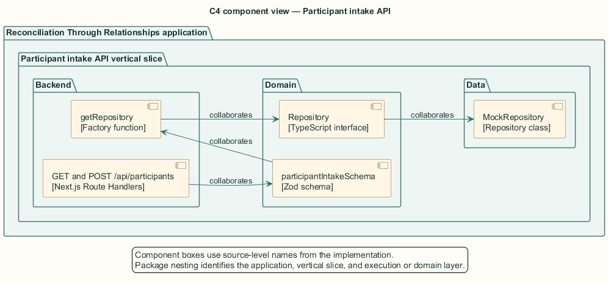
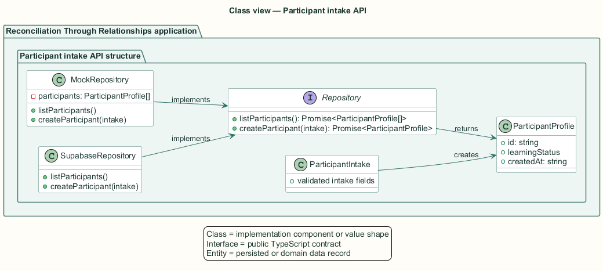
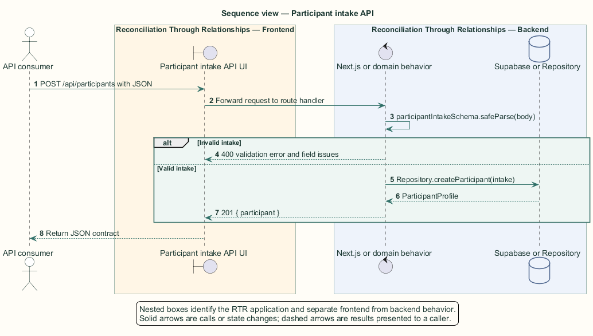

# Participant intake API — Detailed design

## Overview

Participant intake API — vertical slice that lists participants and validates creation requests against the shared intake schema before delegating persistence to the configured repository

The repository seam exposes a camel-case participant domain contract used by the mock-backed regional map and demonstration API. It is separate from the Supabase table access used by the browser onboarding wizard.

The route handler selects `MockRepository` by default or `SupabaseRepository` when `DATA_SOURCE=supabase`. The Supabase implementation is an unfilled stub, so the latter configuration throws for every repository operation.

The entity of interest (EoI) is the Participant intake API vertical slice of the Reconciliation Through Relationships platform. This focused architecture description (AD) describes that slice and does not claim full conformance with 42010:2022.

## Description

### Components, types, functions, and classes

| Element | Kind | Source | Responsibility and public interface |
| --- | --- | --- | --- |
| `GET and POST /api/participants` | Next.js Route Handlers | `src/app/api/participants/route.ts` | `GET()` lists; `POST(request)` parses, validates, and creates. |
| `participantIntakeSchema` | Zod schema | `src/domain/schema.ts` | `safeParse` produces `ParticipantIntake` or flattened field issues. |
| `getRepository` | Factory function | `src/data/index.ts` | Returns one process-local `Repository` instance according to `DATA_SOURCE`. |
| `Repository` | TypeScript interface | `src/data/repository.ts` | `listParticipants` and `createParticipant` define the route boundary. |
| `MockRepository` | Repository class | `src/data/mock/mock-repository.ts` | Stores participant records in module memory. |

### Structure and relationships

- Both route methods depend only on the `Repository` interface returned by `getRepository`.

- `POST` applies `participantIntakeSchema.safeParse` before calling `createParticipant`; invalid data never reaches the repository.

- `MockRepository` implements the interface and generates the identifier, initial learning status, and creation timestamp.

### Behaviour

1. The API consumer calls `GET` to retrieve the configured repository collection, or sends JSON to `POST`.

2. `POST` parses the body and applies the shared Zod schema.

3. An invalid body returns status 400 with flattened field errors.

4. A valid body passes to `Repository.createParticipant` and returns status 201 with the created participant.

5. `GET` returns status 200 with the current participant collection.

### Realization notes

- `SupabaseRepository` implements the interface in signature only. Every method throws `Not implemented`; `DATA_SOURCE=supabase` therefore cannot satisfy these route contracts.

## Requirements

This section contains L2 requirements only. It intentionally includes no L1 requirement text. The L1 specification identifier records the traceability correspondence for each L2 requirement.

| L2 specification ID | L1 specification ID | Requirement text |
| --- | --- | --- |
| `L2-ONBRD-061` | `L1-ONBRD-014` | `GET /api/participants` shall return the participant collection from the configured repository. |
| `L2-ONBRD-062` | `L1-ONBRD-014` | `POST /api/participants` shall validate the payload against the shared intake schema and reject invalid submissions with field-level errors. |

## Diagrams

The five architecture views use one caption pattern and stable EoI-local names. Each view component is available as PlantUML source and as an inline Portable Network Graphics (PNG) rendering.

### C4 system context view

[PlantUML source](diagrams/c4-context.puml)

Figure 1 — C4 system context view: the Participant intake API EoI, its actor, and its external dependencies. The view component uses the C4 system context model kind.

### C4 container view

[PlantUML source](diagrams/c4-container.puml)

Figure 2 — C4 container view: the frontend, backend, data, and integration boundaries. The view component uses the C4 container model kind.

### C4 component view

[PlantUML source](diagrams/c4-component.puml)

Figure 3 — C4 component view: the source-level components and their structural relationships. The view component uses the C4 component model kind.

### Class view

[PlantUML source](diagrams/class-diagram.puml)

Figure 4 — Class view: the feature types, functions, classes, entities, and their relationships. The view component uses the Unified Modeling Language (UML) class model kind.

### Sequence view

[PlantUML source](diagrams/sequence-diagram.puml)

Figure 5 — Sequence view: the principal end-to-end feature behavior. Nested application boxes separate frontend behavior from backend behavior. The view component uses the UML sequence model kind.
