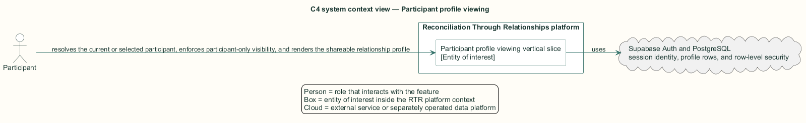
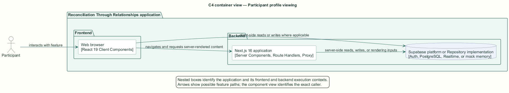
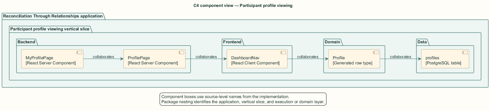
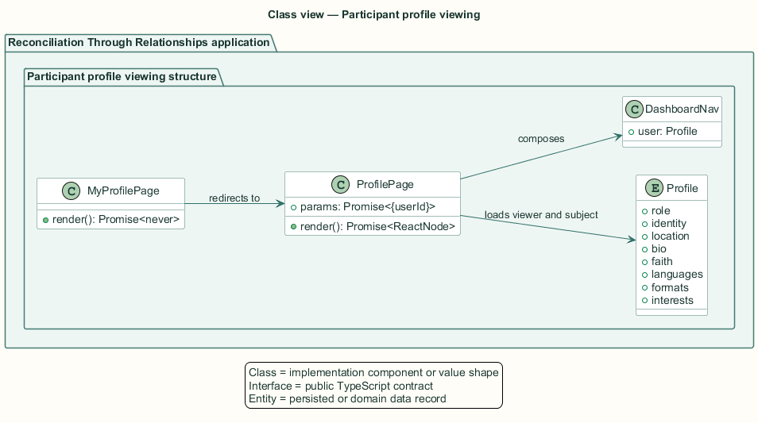
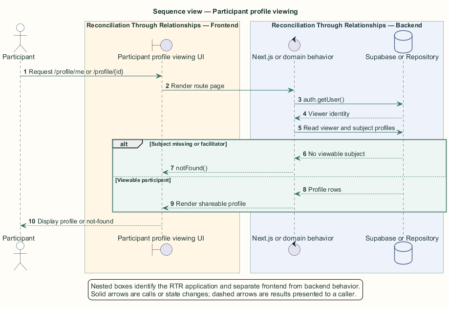

# Participant profile viewing — Detailed design

## Overview

Participant profile viewing — vertical slice that resolves the current or selected participant, enforces participant-only visibility, and renders the shareable relationship profile

A participant profile presents the personal information that supports an informed relationship decision. It includes identity, background, participation categories, location, biography, faith, languages, preferred formats, and interests.

The dynamic route is a server component. Next.js 16 supplies `params` as a promise, so the component awaits `userId` before querying. The `/profile/me` route resolves the authenticated identifier and redirects to the same dynamic route.

The entity of interest (EoI) is the Participant profile viewing vertical slice of the Reconciliation Through Relationships platform. This focused architecture description (AD) describes that slice and does not claim full conformance with 42010:2022.

## Description

### Components, types, functions, and classes

| Element | Kind | Source | Responsibility and public interface |
| --- | --- | --- | --- |
| `MyProfilePage` | React Server Component | `src/app/profile/me/page.tsx` | Redirects the authenticated user to `/profile/{user.id}`. |
| `ProfilePage` | React Server Component | `src/app/profile/[userId]/page.tsx` | Awaits route params, loads viewer and subject, enforces visibility, and renders profile fields. |
| `DashboardNav` | React Client Component | `src/app/dashboard/components/DashboardNav.tsx` | Provides authenticated navigation and notification actions. |
| `Profile` | Generated row type | `src/data/supabase/database.types.ts` | Carries profile display data and the role visibility discriminator. |
| `profiles` | PostgreSQL table | `public.profiles` | Row-level security limits readable profile records. |

### Structure and relationships

- `MyProfilePage` uses the authenticated user identifier to redirect into `ProfilePage`.

- `ProfilePage` loads the viewer and subject concurrently, rejects missing or facilitator subjects with `notFound`, and omits the connect action for the viewer's own profile.

- The page composes shared navigation and design-system components around generated `Profile` fields.

### Behaviour

1. The participant requests `/profile/me` or `/profile/{userId}`.

2. The server validates the session and resolves the subject identifier.

3. The server reads viewer and subject profiles under row-level security.

4. A missing or facilitator subject returns not-found; an absent viewer profile redirects to onboarding.

5. A valid participant subject renders the available profile sections and suppresses self-connection controls.

## Requirements

This section contains L2 requirements only. It intentionally includes no L1 requirement text. The L1 specification identifier records the traceability correspondence for each L2 requirement.

| L2 specification ID | L1 specification ID | Requirement text |
| --- | --- | --- |
| `L2-PROF-031` | `L1-PROF-008` | `/profile/[userId]` shall render the participant's shareable profile. |
| `L2-PROF-032` | `L1-PROF-008` | Facilitator accounts shall not be exposed through the profile page. |
| `L2-PROF-033` | `L1-PROF-008` | `/profile/me` shall resolve to the signed-in user's profile. |

## Diagrams

The five architecture views use one caption pattern and stable EoI-local names. Each view component is available as PlantUML source and as an inline Portable Network Graphics (PNG) rendering.

### C4 system context view

[PlantUML source](diagrams/c4-context.puml)

Figure 1 — C4 system context view: the Participant profile viewing EoI, its actor, and its external dependencies. The view component uses the C4 system context model kind.

### C4 container view

[PlantUML source](diagrams/c4-container.puml)

Figure 2 — C4 container view: the frontend, backend, data, and integration boundaries. The view component uses the C4 container model kind.

### C4 component view

[PlantUML source](diagrams/c4-component.puml)

Figure 3 — C4 component view: the source-level components and their structural relationships. The view component uses the C4 component model kind.

### Class view

[PlantUML source](diagrams/class-diagram.puml)

Figure 4 — Class view: the feature types, functions, classes, entities, and their relationships. The view component uses the Unified Modeling Language (UML) class model kind.

### Sequence view

[PlantUML source](diagrams/sequence-diagram.puml)

Figure 5 — Sequence view: the principal end-to-end feature behavior. Nested application boxes separate frontend behavior from backend behavior. The view component uses the UML sequence model kind.
