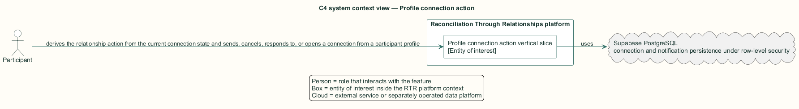
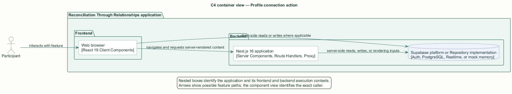
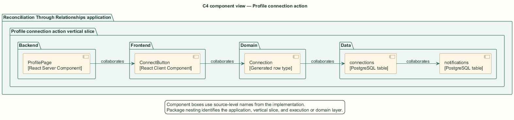
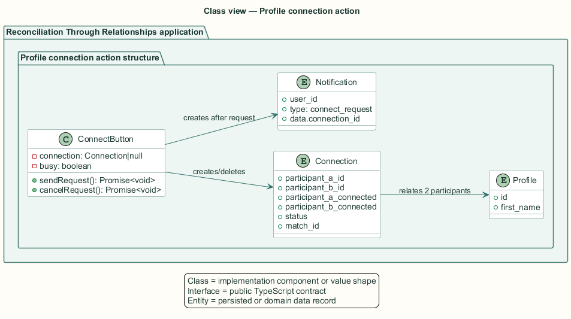
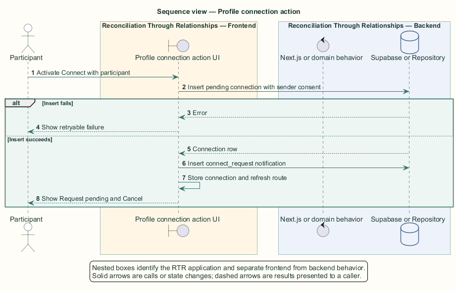

# Profile connection action — Detailed design

## Overview

Profile connection action — vertical slice that derives the relationship action from the current connection state and sends, cancels, responds to, or opens a connection from a participant profile

The profile action is the participant-facing entry to peer-initiated relationships. Its state depends on whether either party has expressed consent and whether the connection is active.

The server profile page discovers an existing connection in either participant order. The client `ConnectButton` owns optimistic action state and performs direct Supabase writes guarded by row-level security.

The entity of interest (EoI) is the Profile connection action vertical slice of the Reconciliation Through Relationships platform. This focused architecture description (AD) describes that slice and does not claim full conformance with 42010:2022.

## Description

### Components, types, functions, and classes

| Element | Kind | Source | Responsibility and public interface |
| --- | --- | --- | --- |
| `ProfilePage` | React Server Component | `src/app/profile/[userId]/page.tsx` | Queries the relationship in either direction and passes it to the client action. |
| `ConnectButton` | React Client Component | `src/app/profile/[userId]/ConnectButton.tsx` | Derives action state and owns `sendRequest` and `cancelRequest`. |
| `Connection` | Generated row type | `src/data/supabase/database.types.ts` | Carries participant order, consent flags, status, and nullable match identifier. |
| `connections` | PostgreSQL table | `public.connections` | Stores the peer request and its state. |
| `notifications` | PostgreSQL table | `public.notifications` | Receives a `connect_request` row after successful insertion. |

### Structure and relationships

- `ProfilePage` passes viewer, subject, name, and optional connection to `ConnectButton`.

- `ConnectButton.sendRequest` inserts the viewer as participant A with consent true, then inserts a notification for participant B.

- `ConnectButton.cancelRequest` deletes the current pending row; the render branches map state to Connect, Request pending and Cancel, Respond to request, or Open chat.

### Behaviour

1. The participant opens another participant's profile.

2. The server loads any relationship between the pair and initializes the action state.

3. With no relationship, Send request inserts a pending connection and then a recipient notification.

4. The client shows pending state after success or a retryable error after failure.

5. The sender may cancel; a recipient may open the connection to respond; active participants may open chat.

### Realization notes

- The database has no unique constraint for an unordered participant pair. Concurrent opposite-direction requests can therefore create parallel connection rows.

## Requirements

This section contains L2 requirements only. It intentionally includes no L1 requirement text. The L1 specification identifier records the traceability correspondence for each L2 requirement.

| L2 specification ID | L1 specification ID | Requirement text |
| --- | --- | --- |
| `L2-PROF-034` | `L1-PROF-008` | The profile page's connect action shall reflect the current connection state and drive its transitions. |

## Diagrams

The five architecture views use one caption pattern and stable EoI-local names. Each view component is available as PlantUML source and as an inline Portable Network Graphics (PNG) rendering.

### C4 system context view

[PlantUML source](diagrams/c4-context.puml)

Figure 1 — C4 system context view: the Profile connection action EoI, its actor, and its external dependencies. The view component uses the C4 system context model kind.

### C4 container view

[PlantUML source](diagrams/c4-container.puml)

Figure 2 — C4 container view: the frontend, backend, data, and integration boundaries. The view component uses the C4 container model kind.

### C4 component view

[PlantUML source](diagrams/c4-component.puml)

Figure 3 — C4 component view: the source-level components and their structural relationships. The view component uses the C4 component model kind.

### Class view

[PlantUML source](diagrams/class-diagram.puml)

Figure 4 — Class view: the feature types, functions, classes, entities, and their relationships. The view component uses the Unified Modeling Language (UML) class model kind.

### Sequence view

[PlantUML source](diagrams/sequence-diagram.puml)

Figure 5 — Sequence view: the principal end-to-end feature behavior. Nested application boxes separate frontend behavior from backend behavior. The view component uses the UML sequence model kind.
