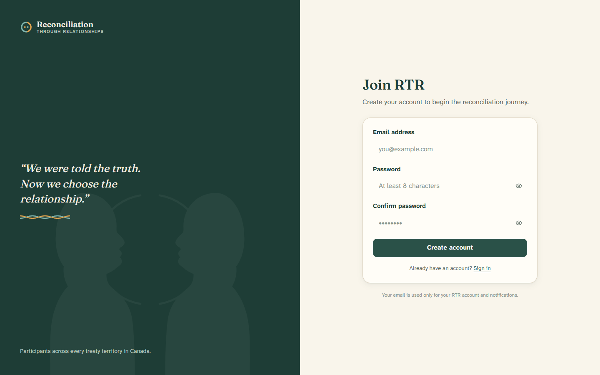
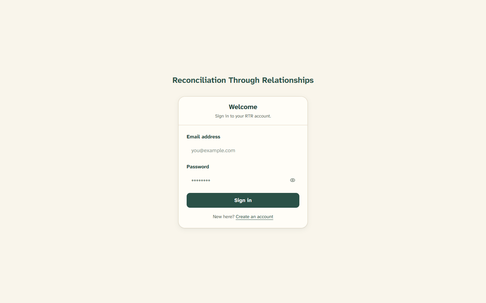

# 1. Creating your account

[← Back to contents](README.md)

To use RTR, you first create a free account with your email address and a
password. This page shows you how.

---

## Signing up for the first time

1. Go to the RTR website. On the welcome page, click **Begin your journey**
   (or **Join RTR** in the top-right corner).
2. You'll see the **Join RTR** page.

3. Fill in the form:
   - **Email address** — the email you check most often. RTR uses it only for
     your account and for notifications from the platform.
   - **Password** — pick a password with **at least 8 characters**. Click the
     little eye icon to show or hide what you're typing.
   - **Confirm password** — type the same password again so we know it's correct.
4. Click **Create account**.

That's it — your account is created and you'll go straight to the next step,
[building your profile](02-building-your-profile.md).

> **Already have an account?** Click **Sign in** at the bottom of the form.

---

## Signing in later

When you come back to RTR, you sign in with the email and password you chose.

1. Click **Sign in** (top-right of the welcome page), or go to the sign-in page.
2. You'll see the **Welcome** screen.

3. Enter your **email address** and **password**, then click **Sign in**.
4. RTR takes you to the right place automatically:
   - If you haven't finished your profile yet → your **profile form**.
   - If you've finished your profile but not the learning → your **learning
     journey**.
   - If you've finished both → your **dashboard**.

> **New here?** If you don't have an account yet, click **Create an account**
> at the bottom of the sign-in card.

---

## If something goes wrong

- **"Invalid login credentials"** usually means the email or password was typed
  incorrectly. Check for typos and try again. Remember the eye icon lets you see
  your password as you type.
- Make sure you're using the **same email** you signed up with.
- Still stuck? See [Questions and help](09-questions-and-help.md).

---

Next: [Building your profile →](02-building-your-profile.md)
