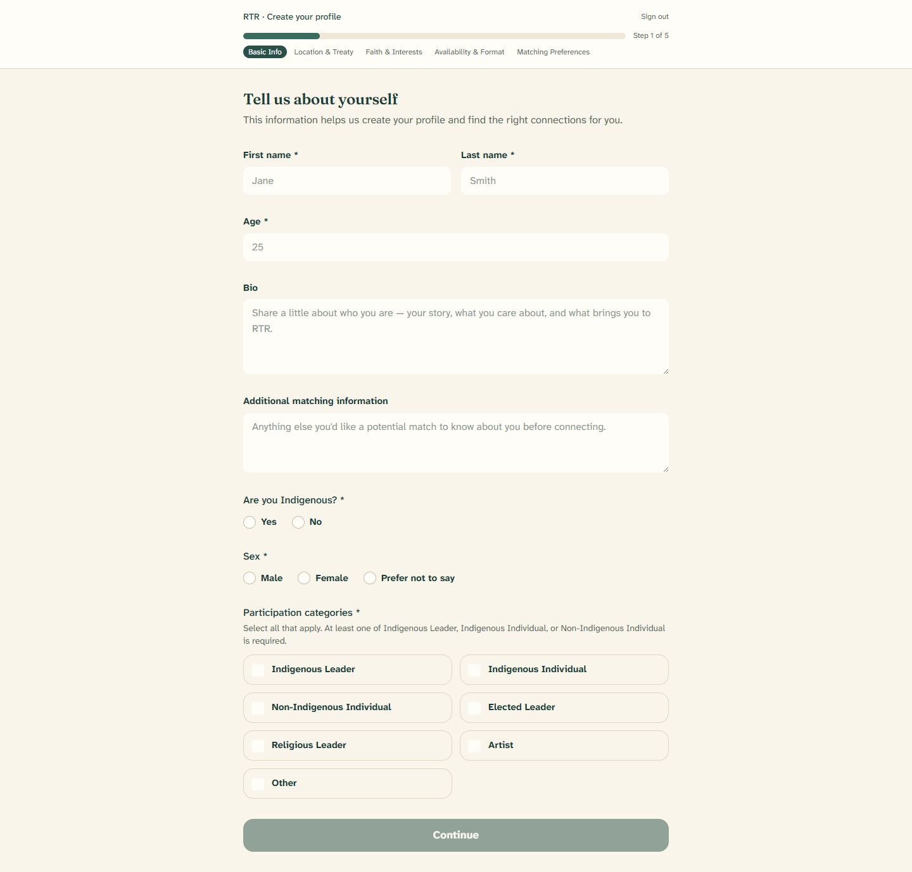
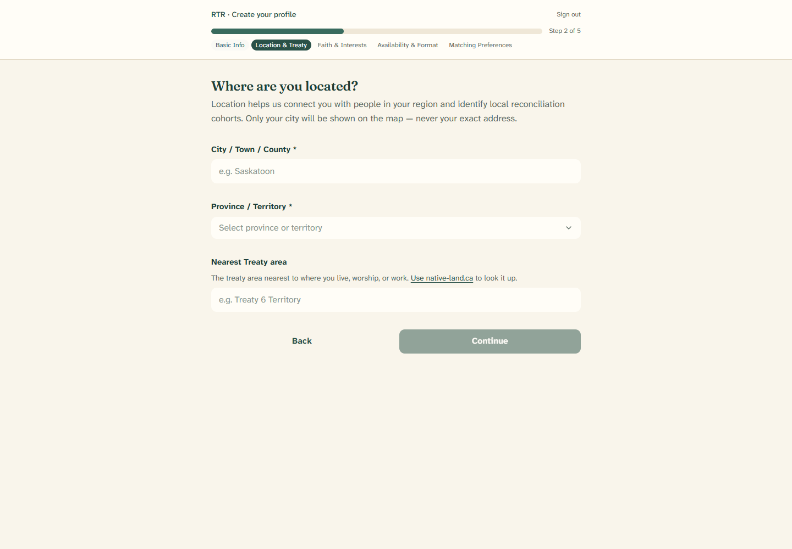
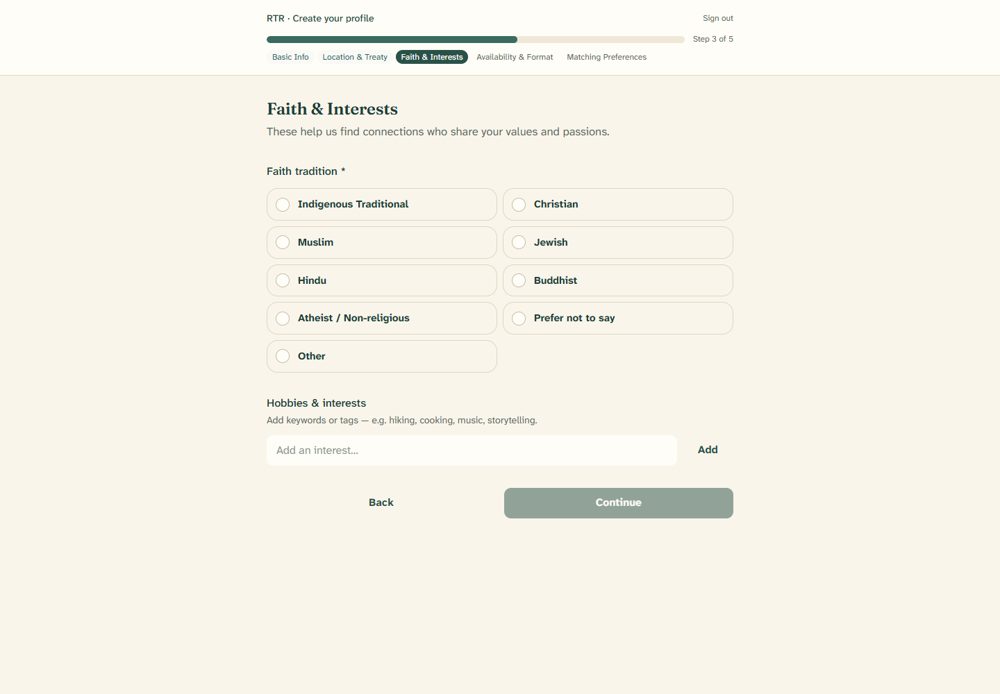
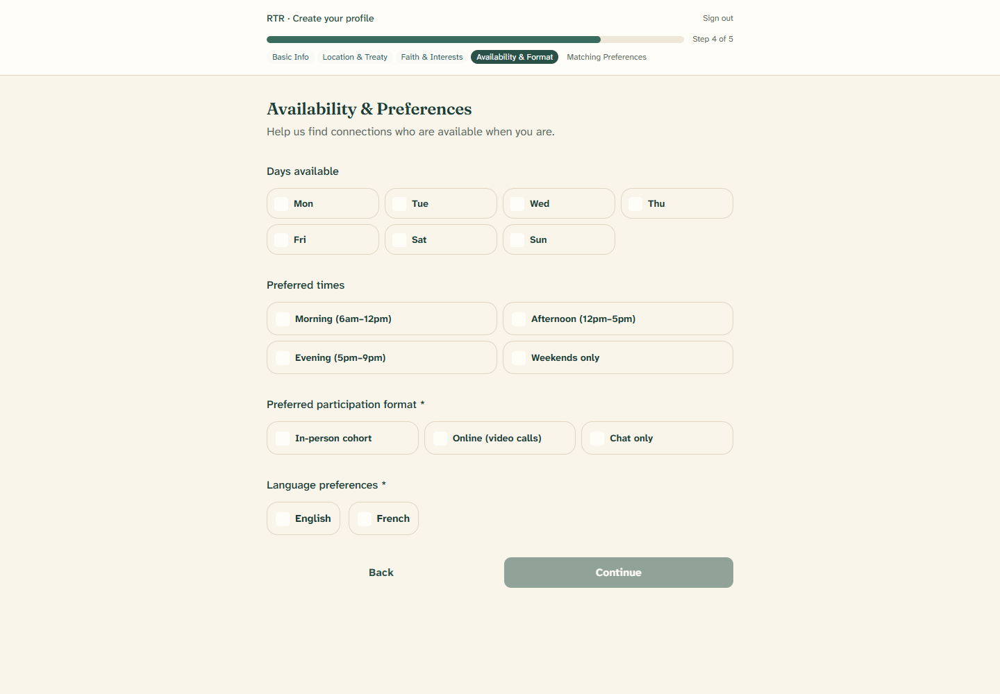
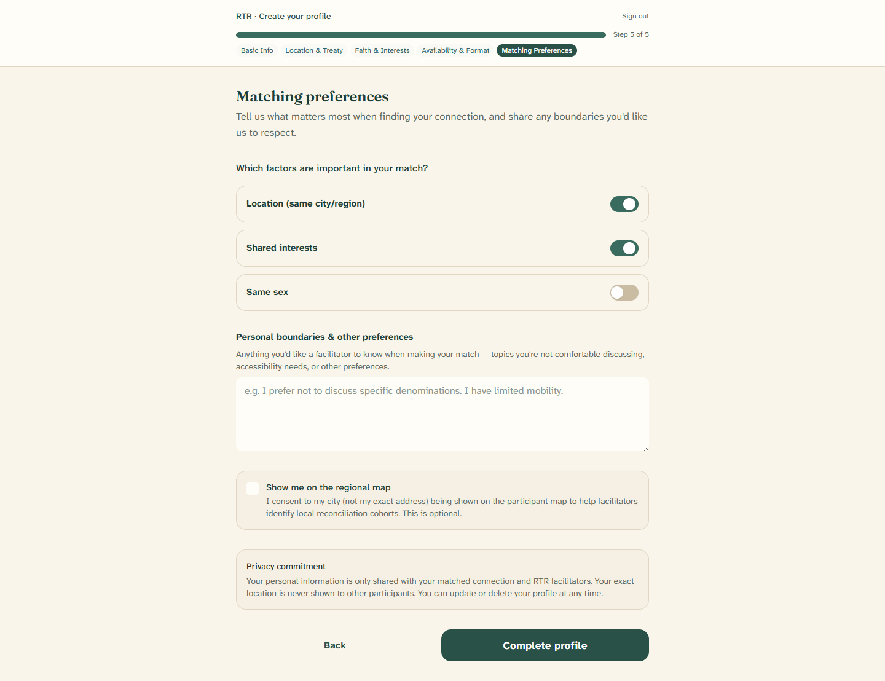

# 2. Building your profile

[← Back to contents](README.md)

After you create your account, RTR asks you to introduce yourself. This is your
**profile**. It helps facilitators find you a thoughtful match and helps others
get to know you.

The form has **five short steps**. A bar at the top shows how far along you are
("Step 1 of 5"). You can always click **Back** to change an earlier answer.
Nothing is shared with anyone until you finish.

Fields marked as required must be filled before the **Continue** button turns on.

---

## Step 1 — Tell us about yourself

- **First name** and **Last name.**
- **Age.**
- **Bio** (optional) — a few sentences about who you are, what you care about,
  and what brings you to RTR.
- **Additional matching information** (optional) — anything else you'd like a
  possible match to know about you before connecting.
- **Are you Indigenous?** — choose **Yes** or **No**.
- **Sex** — Male, Female, or Prefer not to say.
- **Participation categories** — tick every box that describes you. You must
  choose **at least one** of *Indigenous Leader*, *Indigenous Individual*, or
  *Non-Indigenous Individual*. You may also add *Elected Leader*, *Religious
  Leader*, *Artist*, or *Other*.

When the required fields are filled, click **Continue**.

---

## Step 2 — Where are you located?

- **City / Town / County** — for example, *Saskatoon*.
- **Province / Territory** — choose from the list.
- **Nearest treaty area** (optional) — the treaty area nearest to where you
  live, worship, or work. If you're not sure, use the **native-land.ca** link on
  the page to look it up.

> **Your privacy:** only your **city** is ever shown on the map — never your
> exact address.

Click **Continue** when you're ready.

---

## Step 3 — Faith and interests

- **Faith tradition** — pick the one that fits best: Indigenous Traditional,
  Christian, Muslim, Jewish, Hindu, Buddhist, Atheist / Non-religious, Prefer
  not to say, or Other. If you choose **Other**, a box appears so you can type
  your own.
- **Hobbies and interests** (optional) — type a word like *hiking* or
  *storytelling* and press **Enter** (or click **Add**). Each one becomes a small
  tag. Click the **✕** on a tag to remove it. Add as many as you like.

Click **Continue.**

---

## Step 4 — Availability and preferences

- **Days available** (optional) — tick the days that usually work for you.
- **Preferred times** (optional) — Morning, Afternoon, Evening, or Weekends only.
- **Preferred participation format** — choose at least one: *In-person cohort*,
  *Online (video calls)*, or *Chat only*.
- **Language preferences** — choose at least one: *English* or *French*.

Click **Continue.**

---

## Step 5 — Matching preferences

This last step is about what matters most to you, and about your privacy.

- **Which factors are important in your match?** — turn on any that matter to
  you: *Location*, *Shared interests*, or *Same sex*. These are optional.
- **Personal boundaries and other preferences** (optional) — anything you'd like
  a facilitator to keep in mind: topics you'd rather not discuss, accessibility
  needs, or other preferences.
- **Show me on the regional map** (optional) — tick this only if you're happy for
  your **city** (never your exact address) to appear on the map. This helps
  facilitators spot places where a local group could form. You can change this
  choice any time later.
- **Privacy commitment** — a reminder that your information is only shared with
  your matched connection and RTR facilitators, that your exact location is never
  shown to other participants, and that you can update or delete your profile
  whenever you wish.

When you're ready, click **Complete profile**. You'll see a friendly message and
move straight to the [learning journey](03-the-learning-journey.md).

---

Next: [The learning journey →](03-the-learning-journey.md)
