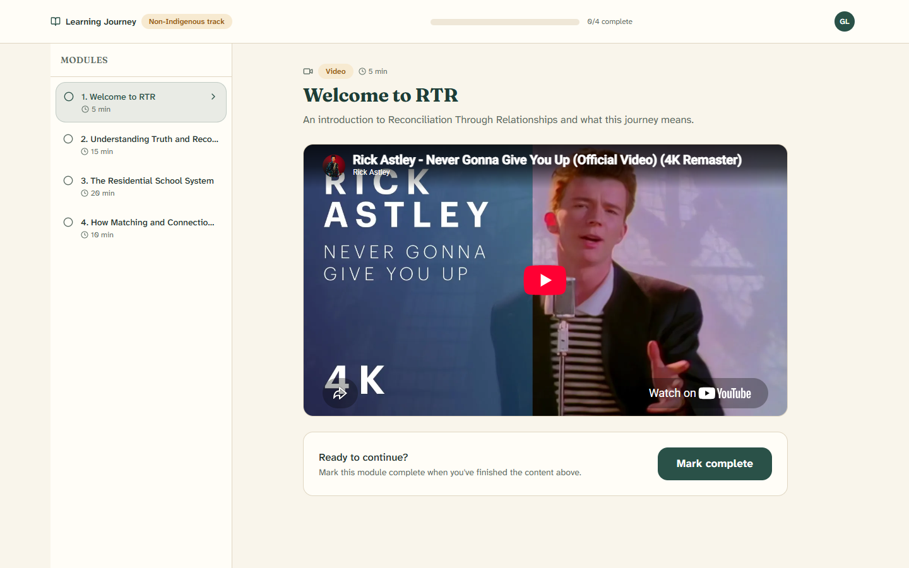
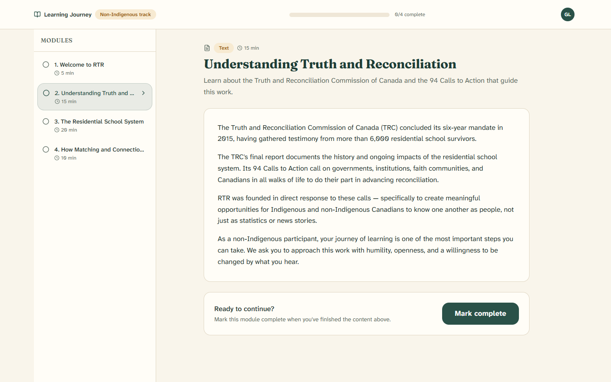

# 3. The learning journey

[← Back to contents](README.md)

Before you can be matched with anyone, RTR asks you to complete a short
**learning journey**. It's a small set of videos and readings that build a
shared foundation for respectful, meaningful conversation.

This step is required for a reason: it means everyone comes to their first
relationship having done a little preparation together.

---

## What the learning screen looks like

- **Top bar** — shows "Learning Journey", which **track** you're on, and a
  progress bar (for example, "2/4 complete").
- **Module list** (left side) — every lesson in order. A **circle** means "not
  done yet"; a **check mark** means "finished". Some lessons are marked
  *Optional*.
- **Main area** (right side) — the lesson you're currently reading or watching.

> **Two tracks.** Indigenous and non-Indigenous participants see slightly
> different lessons, chosen to fit their journey. That's why your list may look a
> little different from a friend's.

---

## Going through a lesson

1. Click a lesson in the list to open it.
2. Each lesson is either a **video** to watch or a short **reading**. A label
   near the top tells you which, along with about how long it takes.
3. Read or watch the whole thing.
4. At the bottom you'll see **"Ready to continue?"** Click **Mark complete**.

When you mark a lesson complete:

- The progress bar moves up.
- The lesson gets a green check mark in the list.
- RTR opens the next lesson for you automatically.

You don't have to finish everything in one sitting. When you come back and sign
in, RTR brings you right back to the learning journey where you left off.

---

## Finishing the journey

When you complete the last required lesson, you'll see a celebration message —
**"Learning journey complete!"** — and RTR takes you to your **dashboard** a
moment later.

From here on, you're **eligible** to appear on the map, join a local group, and
be recommended for a match.

---

Next: [Your dashboard →](04-your-dashboard.md)
