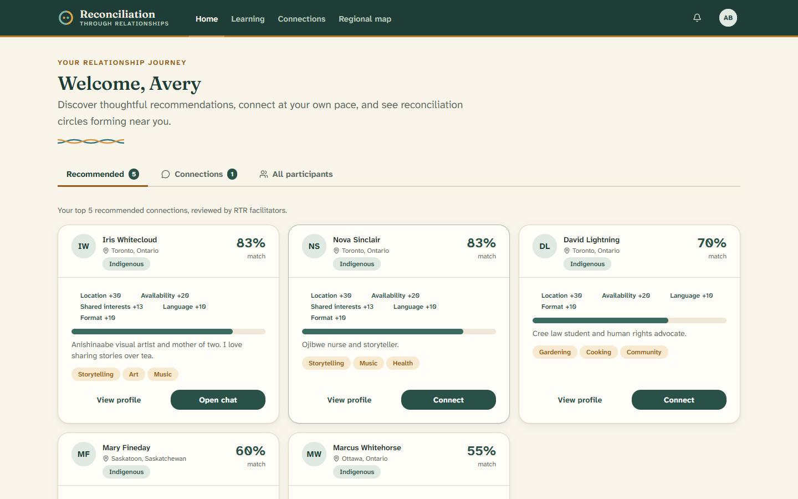
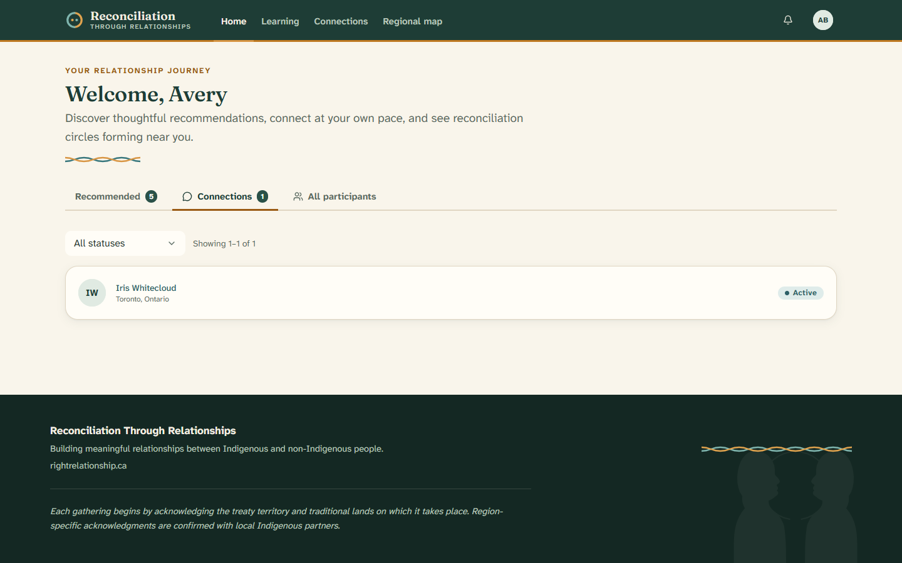
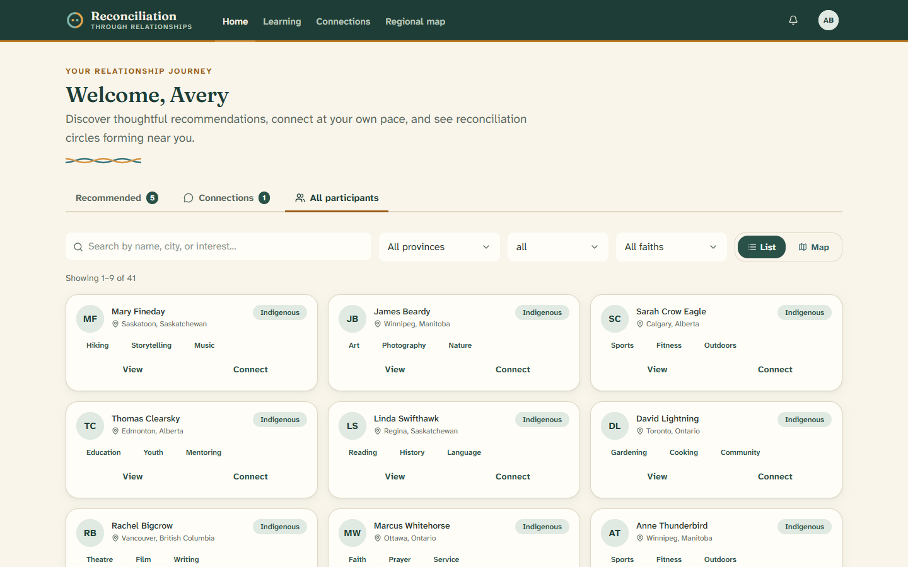

# 4. Your dashboard

[← Back to contents](README.md)

Your **dashboard** is your home base once you've finished the learning journey.
It greets you by name and has three tabs: **Recommended**, **Connections**, and
**All participants**.

---

## Recommended

This tab shows people a facilitator thinks could be a good match for you.

Each card shows:

- The person's **name**, **city**, and whether they are Indigenous or
  non-Indigenous.
- A **match score** as a percentage (like *87%*). A higher number means you have
  more in common — things like living nearby, being free at similar times,
  shared interests, language, and faith. Small tags explain what you share.
- A short piece of their **bio** and a few of their **interests**.
- Buttons to **View profile** or **Connect**. (You'll learn what happens when you
  connect in the [next section](05-connecting-and-messaging.md).)

> **No recommendations yet?** You may see *"No recommendations yet."* That's
> normal — a facilitator reviews potential matches personally, so it can take a
> little time. Check back soon.

### If you're waiting for a match

Sometimes more non-Indigenous participants join than there are Indigenous
participants to match with. If that happens, you may see a **waitlist** message.
It simply means "we'll let you know as soon as there's a good match for you." In
the meantime, you can still explore the community and keep your profile up to
date.

### A note for local leaders

If you're an elected leader and there are enough participants near you, you may
see a banner inviting you to help **organize a local gathering**. This is how
community groups (called *cohorts*) begin — see [The regional
map](06-the-regional-map.md).

---

## Connections

This tab lists the people you're already connected with (or waiting to connect
with).

Each row shows the person's name, city, and a **status**:

- **Active** — you're connected and can chat.
- **Pending** — waiting for the other person to accept.
- **Under review** — a facilitator is reviewing the match.

Click any row to open your conversation. If you have a lot of connections, use
the filter and the **Previous / Next** buttons to move through the list.

> **Nothing here yet?** Until your first match is approved, this tab will say
> *"No active connections yet."*

---

## All participants

This tab lets you browse everyone in the RTR community who has finished their
learning journey.

You can:

- **Search** by name, city, or interest.
- **Filter** by province, background (Indigenous / non-Indigenous), or faith.
- Switch between a **List** view and a **Map** view.

Each person has a **View** button to see their full profile, and a **Connect**
button if you'd like to reach out.

---

Next: [Connecting and messaging →](05-connecting-and-messaging.md)
