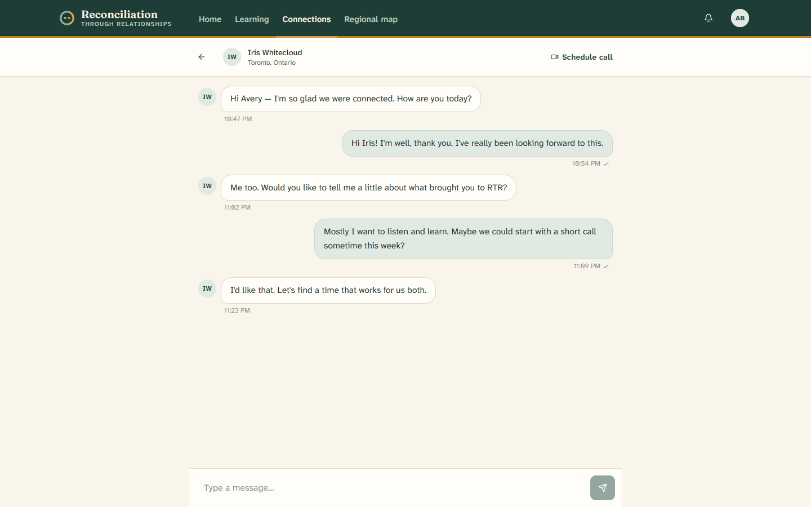
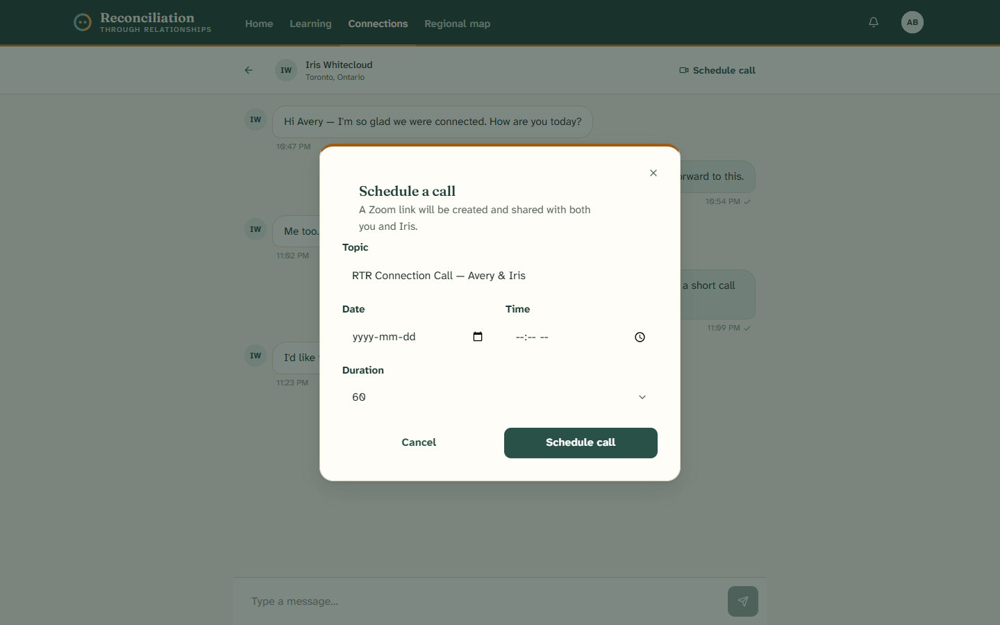

# 5. Connecting and messaging

[← Back to contents](README.md)

This is the heart of RTR: meeting another person and beginning a relationship.
This page explains how connecting works, how to chat, and how to set up a call.

---

## How connecting works

A connection is always **mutual** and always **your choice**.

1. You find someone — from your **Recommended** list or by browsing **All
   participants** — and click **Connect** (or open their profile and connect
   from there).
2. The other person is invited to connect back. **Both** of you must agree.
3. A **facilitator reviews** the match to make sure it's a good, safe fit.
4. Once everything lines up, the connection becomes **Active** and your
   conversation opens.

While you wait, the connection shows as **Pending** (waiting for the other
person) or **Under review** (waiting for a facilitator). This is normal and
means the process is working as intended.

> **Why the review?** A facilitator looking at every match is what keeps RTR
> caring and safe. It's not a test you can fail — it's someone making sure the
> introduction is a good one.

---

## Chatting with your connection

Open a conversation from the **Connections** tab on your dashboard. You'll see a
simple messaging screen.

- Your connection's **name and city** are shown at the top.
- Past **messages** appear in order, with the time they were sent.
- Type in the box at the bottom and click **Send**.

There's no rush, and no script. Your first conversation doesn't need to be about
reconciliation — talk about your lives, your communities, and what you care
about. The relationship comes first.

---

## Setting up a call

When you're both ready to talk face to face, you can schedule a call right from
the conversation.

1. Click **Schedule call** at the top of the conversation.
2. A small window opens.

3. Fill in the details:
   - **Topic** — already filled in with both of your names; change it if you like.
   - **Date** and **Time**.
   - **Duration** — 30 minutes, 1 hour, 1.5 hours, or 2 hours.
4. Click **Schedule call**.

Calls happen through **Zoom**. A Zoom link is created and shared with both you
and your connection, so you'll have a link to join when it's time.

---

Next: [The regional map →](06-the-regional-map.md)
