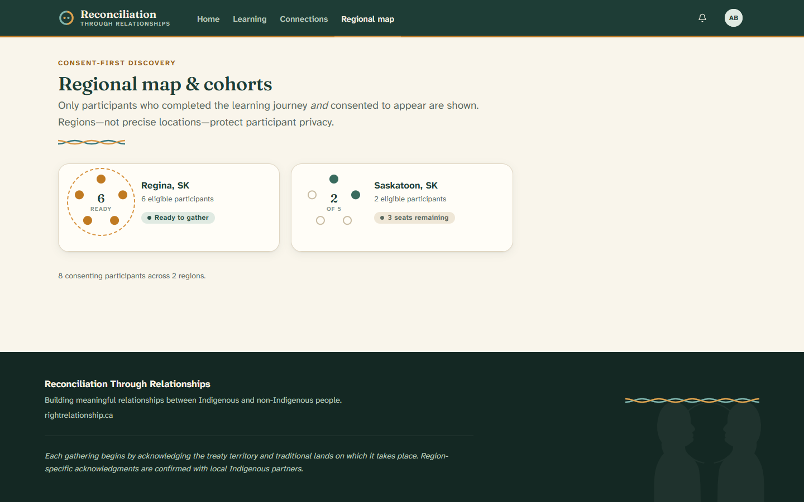

# 6. The regional map

[← Back to contents](README.md)

RTR isn't only about one-to-one friendships. It also helps **local groups** form
so people can gather and take action in their own communities. The **regional
map** is where you can see this happening.

---

## What is a cohort?

A **cohort** is a small group of RTR participants in the same area who come
together for local events — for example:

- a film screening on **June 21**, National Indigenous Peoples Day, or
- a blanket exercise on **September 30**, the National Day for Truth and
  Reconciliation.

A cohort can begin once there are enough eligible people in one region (the
starting number is **five**).

---

## Reading the map

The page groups people by **region** (city and province). Each card shows:

- A **circle** that fills up as more eligible people join that region.
- How many **eligible participants** are there.
- A label: **"Ready to gather"** when the region has enough people, or **"X
  seats remaining"** when a few more are needed.

At the bottom, a line tells you how many people across how many regions have
chosen to appear.

> **Not enough people near you yet?** You may see *"No cohort in your region
> yet."* Every new participant brings a local gathering closer.

---

## Privacy on the map — this matters

RTR is careful with your location:

- You only appear on the map if you **chose to** (the "Show me on the regional
  map" option during sign-up, which you can change any time).
- You only appear **after** you've completed the learning journey.
- The map shows **regions and cities** — never your exact address.

You're always in control of whether you're shown. See [Your profile and
privacy](07-your-profile-and-privacy.md) to change your choice.

---

Next: [Your profile and privacy →](07-your-profile-and-privacy.md)
