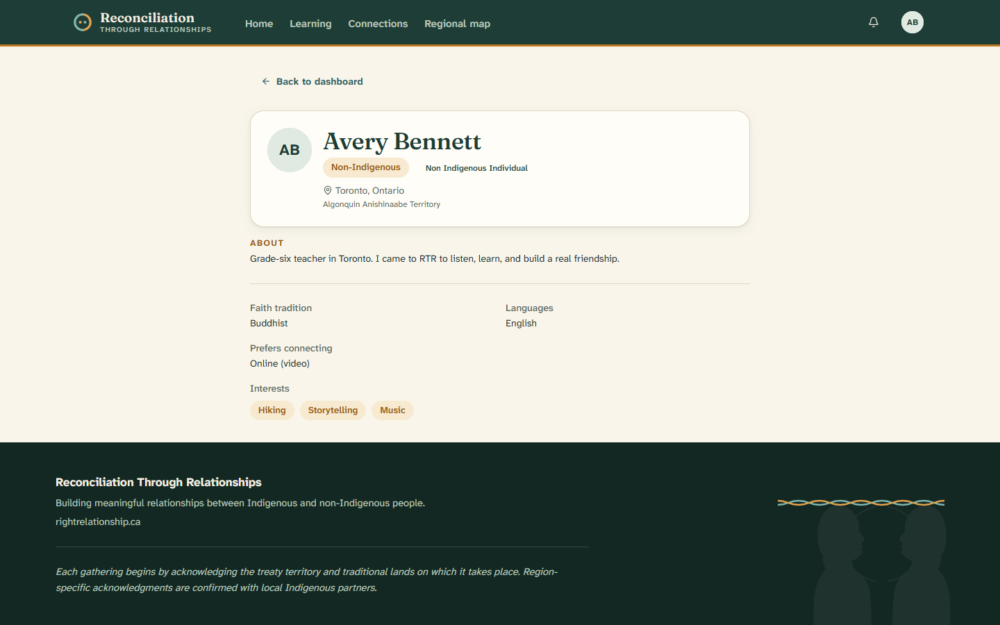

# 7. Your profile and privacy

[← Back to contents](README.md)

This page shows how to find your way around, how to see your own profile, and
how RTR protects your privacy.

---

## Finding your way around

Once you're signed in, the menu across the top of the page takes you to the main
areas:

- **Home** — your dashboard.
- **Learning** — your learning journey.
- **Connections** — your conversations.
- **Regional map** — local groups forming near you.

In the top-right corner there's a **bell** for notifications (for example, when a
match is approved) and a **circle with your initials** — your account menu.

## Seeing your profile

Click the **circle with your initials** in the top-right corner, then choose
**My profile**. You'll see the profile other participants see, built from the
answers you gave when you signed up:

- Your **name**, **age**, and whether you're Indigenous or non-Indigenous.
- Your **participation categories** (such as *Artist* or *Religious leader*).
- Your **city** and **treaty area**.
- Your **About** text, **faith tradition**, **languages**, how you **prefer to
  connect**, and your **interests**.

Notice what is **not** shown to others: your email address and your exact
address are never on your public profile.

---

## How RTR protects your privacy

RTR makes a few clear promises:

- Your personal information is only shared with **your matched connection** and
  **RTR facilitators** — not with everyone.
- Your **exact location is never shown** to other participants. Only your city
  appears, and only if you chose to be on the map.
- You choose whether you appear on the **regional map** at all. You made this
  choice during sign-up ("Show me on the regional map"), and it can be changed.

If you'd like to update your details or your map choice, or remove your profile,
ask an **RTR facilitator** — they can help.

---

## Signing out

When you're done, open the **account menu** (your initials, top-right) and click
**Sign out**. This is a good idea if you're using a shared or public computer.

---

Next: [For facilitators →](08-for-facilitators.md)
