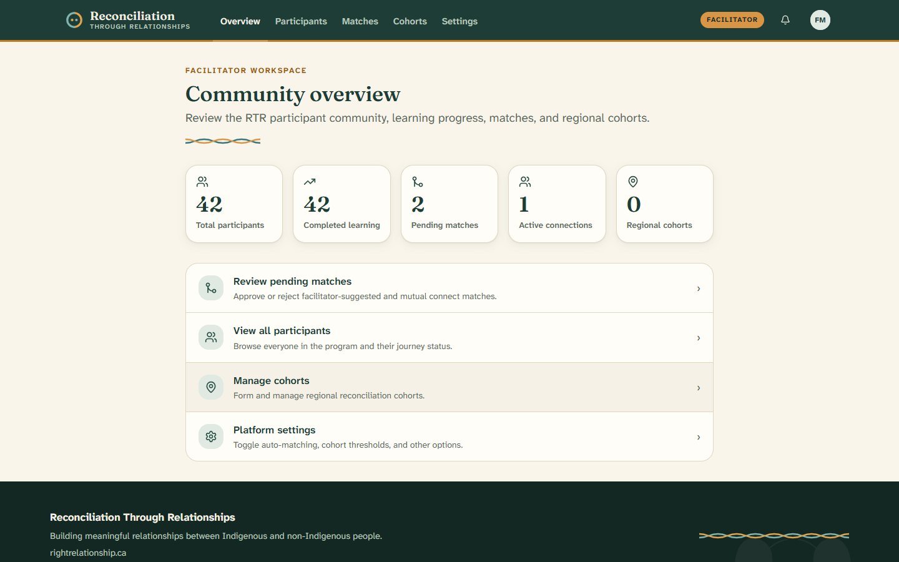
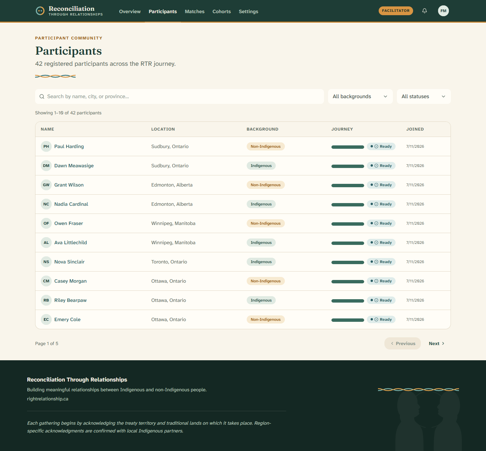
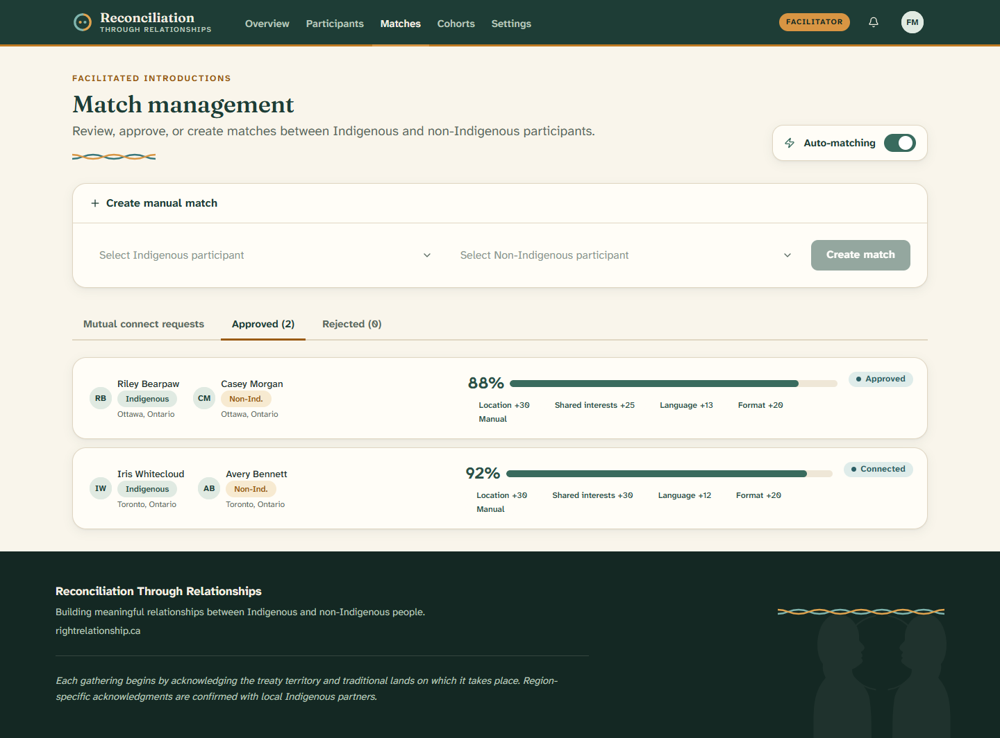
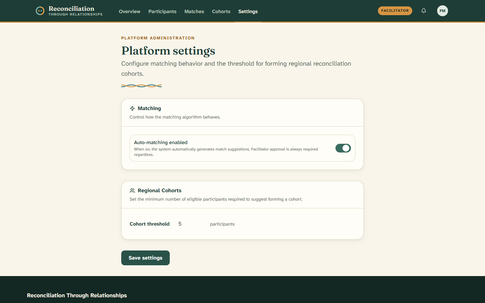

# 8. For facilitators

[← Back to contents](README.md)

This section is for **facilitators** — the trained people who guide the RTR
community. Facilitators don't go through the learning journey. Instead, they have
a **workspace** for reviewing matches, keeping an eye on participants, and
helping local groups form.

Your menu across the top has five areas: **Overview**, **Participants**,
**Matches**, **Cohorts**, and **Settings**.

---

## Overview

This is your home screen. It gives you the big picture at a glance.

- **Summary numbers** — total participants, how many have completed learning,
  matches waiting for review, active connections, and regional cohorts. Click
  any number to jump to the details.
- **Quick actions** — shortcuts to review matches, view participants, manage
  cohorts, and open settings.

---

## Participants

A complete list of everyone in the program and where they are in their journey.

- **Search** by name, city, or province.
- **Filter** by background (Indigenous / non-Indigenous) or by journey stage.
- The **Journey** column shows a small progress bar and a status:
  - **Onboarding** — still filling out their profile.
  - **Learning** — profile done, working through the lessons.
  - **Ready** — finished learning and eligible to be matched.

Click anyone's name to open their full profile.

---

## Matches

This is where you review and create matches between Indigenous and
non-Indigenous participants. **Every match needs your approval before people are
connected.**

**Reviewing requests.** The **Mutual connect requests** tab lists pairs where
both people asked to connect. For each one you can:

- Click a name to read their full profile.
- Click **Approve** — both people are notified and can start chatting.
- Click **Reject** — the request is removed.

**Understanding the score.** Approved matches show a **match score** out of 100,
with tags explaining it (location, availability, shared interests, language,
faith, and format). This helps you see *why* two people fit.

**Creating a match yourself.** Use the **Create manual match** card at the top:
choose one Indigenous participant and one non-Indigenous participant (only people
who finished learning appear), then click **Create match**. The system works out
a score for you to review.

**Auto-matching.** A toggle lets the system suggest matches automatically. Even
with it on, **your approval is still required** for every match.

The **Approved** and **Rejected** tabs keep a record of past decisions.

---

## Cohorts

The **Cohorts** menu opens the [regional map](06-the-regional-map.md), where you
can see which areas have enough eligible participants to form a local group.

---

## Settings

Two simple controls for how the platform behaves.

- **Auto-matching enabled** — turn automatic match suggestions on or off.
  (Approval is always required, either way.)
- **Cohort threshold** — the smallest number of eligible participants needed in a
  region before RTR suggests forming a cohort (the starting value is 5).

Change what you need and click **Save settings**.

---

Next: [Questions and help →](09-questions-and-help.md)
