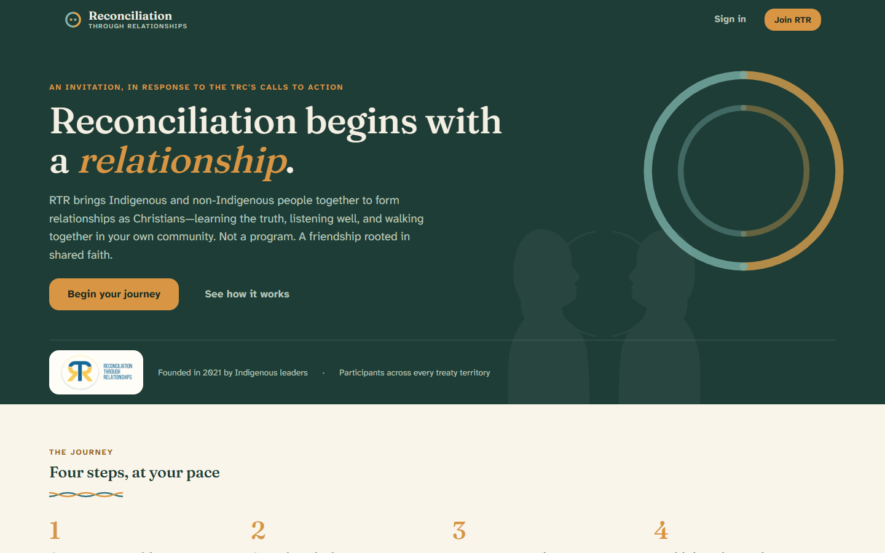

# RTR User Guide

Welcome to **Reconciliation Through Relationships (RTR)**. This guide explains,
in plain language, how to use the RTR website — step by step, with pictures.

You don't need any technical knowledge to follow along. If you can use email and
a web browser, you can use RTR.

---

## What is RTR?

RTR brings **Indigenous and non-Indigenous people together** — to learn the
truth, listen well, and walk together in their own communities. It is not a
program to complete. It is a relationship to begin.

RTR grew out of Christian faith communities responding to the Truth and
Reconciliation Commission's calls to action, and it is rooted in that shared
faith. It was founded in 2021 by Indigenous leaders.

## Who is this guide for?

There are two kinds of people who use RTR:

- **Participants** — anyone joining RTR to learn and to be matched with someone
  for a one-to-one relationship. Most of this guide is for you.
- **Facilitators** — the trained people who guide the community, review matches,
  and help form local groups. There is a section just for you near the end.

## How the journey works

Everyone moves through the same four steps, at their own pace:

1. **Create your profile** — Share who you are, what you value, and how you like
   to connect.
2. **Complete the learning journey** — A short set of videos and readings that
   build a shared foundation for respectful conversation.
3. **Meet your match** — A facilitator reviews every recommendation before you
   are introduced. You always choose whether to connect.
4. **Build the relationship** — Talk, listen, and take part in reconciliation in
   your community.

You can only be matched with someone **after** you finish the learning journey.
This is on purpose — it makes sure everyone starts from a place of understanding.

---

## Table of contents

Read these in order the first time, or jump to what you need.

1. [Creating your account](01-creating-your-account.md) — sign up and sign in.
2. [Building your profile](02-building-your-profile.md) — the five-step
   introduction form.
3. [The learning journey](03-the-learning-journey.md) — videos, readings, and
   marking your progress.
4. [Your dashboard](04-your-dashboard.md) — recommendations, connections, and
   the participant community.
5. [Connecting and messaging](05-connecting-and-messaging.md) — how to connect,
   chat, and set up a call.
6. [The regional map](06-the-regional-map.md) — how local groups (cohorts) form.
7. [Your profile and privacy](07-your-profile-and-privacy.md) — updating your
   details and controlling what others see.
8. [For facilitators](08-for-facilitators.md) — reviewing matches, managing
   participants, and settings.
9. [Questions and help](09-questions-and-help.md) — answers to common questions.

---

> **A note about the pictures in this guide.** Every name, face, and message you
> see in the screenshots is made-up demonstration data — not a real person. Your
> own information is private and is only shared as described in
> [Your profile and privacy](07-your-profile-and-privacy.md).
